[](https://github.com/yinhaide/Rocket-master/wiki)
[](https://github.com/yinhaide/Rocket-master/wiki)
[](https://www.apache.org/licenses/LICENSE-2.0)

# Vigatom
Vigatom是ViewGroup+Atom的缩写，也就是用ViewGroup作为最小页面跳转单元的UI框架的简称。Vigatom的创作初衷是为了应对智能硬件屏幕碎片化问题，实现多厂商多设备的应用合并的技术尝试。
对于应用合并技术可行性。Vigatom作为UI框架的解决方案，将页面切换单元降级，适配各种各样的硬件形态。
Vigatom吸收早期写的[单Activity+多Fragment UI框架](https://github.com/yinhaide/HDRocket)UI框架的思想，做了扩展，加了很多特性，能够应对更加复杂的应用场景。  

在Vigatom的思想中，基于一切元素皆ViewGroup的原则，包括吐司、进度框、对话框、状态栏等元素。那在什么场景下适用Vigatom UI框架？

+ **放弃Activity内存消耗大户，追求轻量化的极简主义**
+ **不想适配Fragment复杂生命周期，只要考虑ViewGroup的Attach和Dettach两种业务场景**
+ **适配带有主副屏的双屏异显硬件设备，完美兼容Presentation的场景**
+ **受够了硬件屏幕碎片化，采用Vigatom百分比布局方案**

## 功能展示

|吐司/悬浮框|加载/进度框|对话框|内存泄漏|卡顿检测|
|:-----------:|:-----:|:---------:|:---------:|:---------:|
|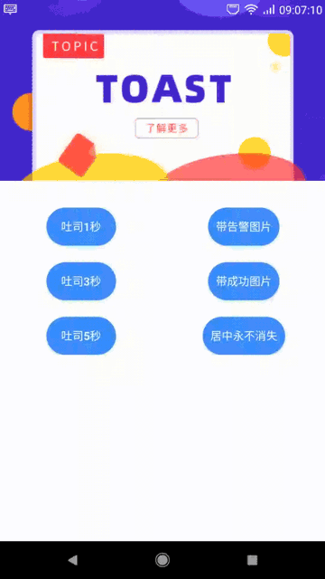|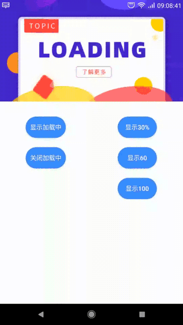|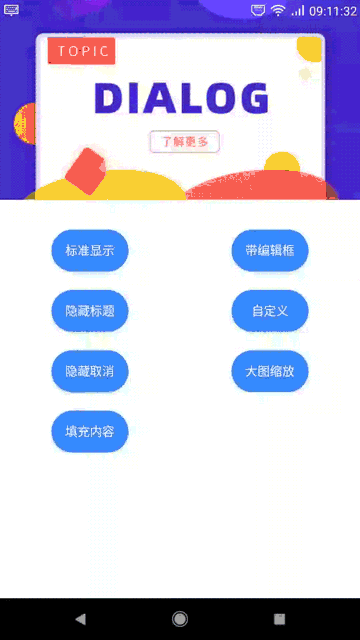|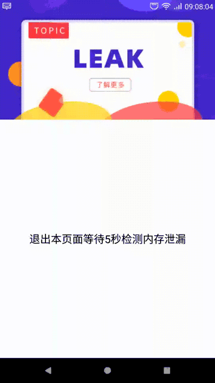|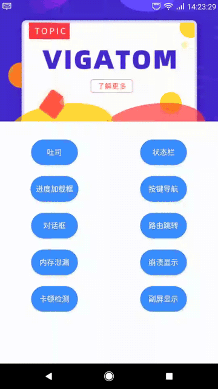|

|状态栏|按键|路由|崩溃显示|副屏/画中画|
|:-----------:|:-----:|:---------:|:---------:|:---------:|
|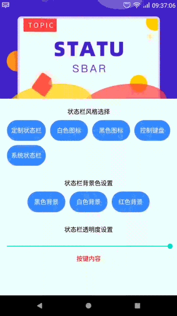|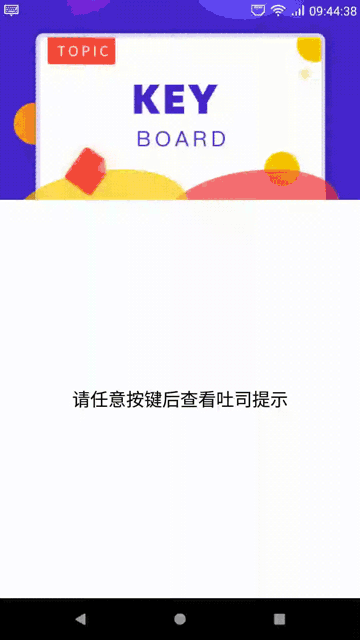|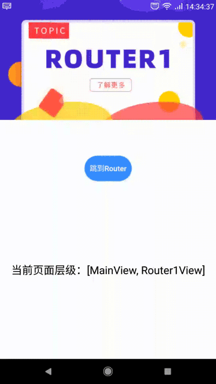|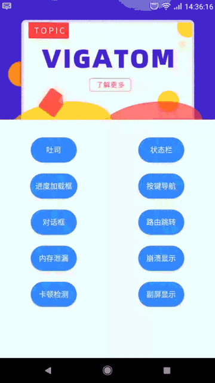|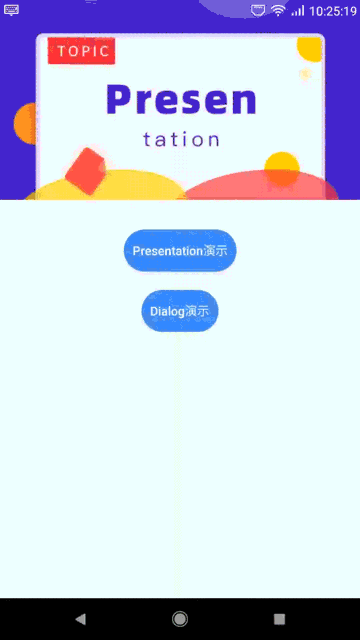|

## 特性
+ **无任何第三方依赖，纯原生编写，无需担心因为版本迭代导致的维护问题**

+ **最低的内存消耗，轻量化UI框架**

+ **提供轻量化的内存检测方案，UI空闲的时候才会执行，保证性能耗时在10毫秒级别**

+ **提供轻量化的卡顿检测方案，无性能消耗，可自定义卡顿阈值**

+ **采用线性路由栈，自行管理回退以及内存回收，支持复杂的路由跳转与携参逻辑**

+ **自定义吐司，可随意定义显示时长，无需考虑吐司系统限制问题**

+ **集成状态栏管理，可适配状态栏各种场景，包括沉浸式风格和自定义状态栏**

+ **支持ViewGroup转场动画**

+ **支持Activity、Fragment、Dialog、Presentation，ViewGroup等作为Vigatom容器**

+ **提供百分比布局和丰富的百分比属性，支持PercentRelativeLayout、PercentLinearLayout、PercentFrameLayout、PercentAbsoluteLayout、PercentGrideLayout、PercentTableLayout**

+ **适配横竖屏的场景，解决屏幕碎片化适配问题，适配双屏异显的双屏幕硬件设备，具有广泛的通用性**

## 适用各种硬件形态
<div align=center>
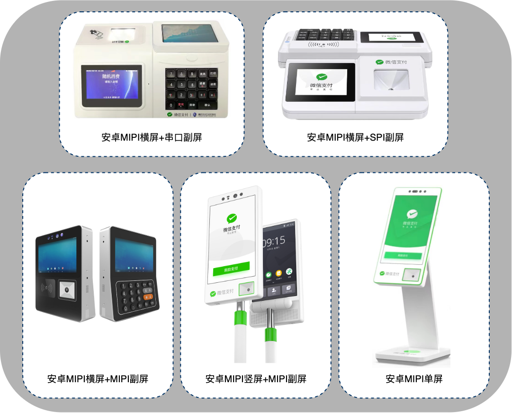
</div>

## 分享Vigatom架构的设计思路
**1、为什么要设计这个架构**
> Activity是一个非常重量级的设计。Activity的创建并不能由开发者自己控制，它是通过多进程远程调用并最终通过放射的方式创建的。在此期间，AMS需要做大量的工作，以至于Activity的启动过程极其缓慢。
> 同时，Activity切换的开销也非常重量级，很容易造成卡顿，用户体验不好。为此Android团队在Android 3.0的时候引入了Fragment。根据词海的翻译可以译为:碎片、片段，可以很好解决Activity间的切换不流畅。因为是轻量切换，性能更好，更加灵活。
> Fragment页面切换耗时22ms新增387kb内存，Activity页面切换耗时84ms新增6765kb内存，差别巨大，所以早期我编写了一套高性能Fragmet框架。但是，对于Vigatom又有什么表现呢？以最简单的布局为例，页面切换耗时6ms，内存增加56kb，
> 相比Fragment，又有大幅度的提升。所以Vigatom是个高性能UI框架。

**2、如何设计Vigatom的路由栈**
> 一个好用的框架必然有一个好用的路由管理、堆栈管理的机制。Vigatom的路由栈设计原则为:一个ViewGroup对应一个线性的路由栈，同一个页面对象只能存在一个，通过findViewByTag的方式查找唯一对象。所有的页面回退、内存回收以及生命周期管理都是内部完成，开发者只要专注跳转目标即可。
> 同时，为了实现页面跳转携参方便，内部做了兼容处理，支持任意序列化对象的传递，避免引入复杂的包括handle、广播、接口回调、Eventbus等机制，保证框架的轻量。

**3、如何实现沉浸式状态栏与正常状态栏的无缝切换**
> 状态栏有两种形态，显示以及隐藏。隐藏的时候整个页面向上顶满屏幕，带来很严重的突兀感。状态栏依附的是window窗体，在Vigatom框架中，因为我们的页面单位是ViewGroup，也就是说只要一个页面切换状态栏都会导致整个窗体一起变化。
> Vigatom提供一个方法，让用户自定义的标题栏可以向上或者向下偏移一个状态栏高度，在页面切换前后动态控制，避免突兀。对于沉浸风格的实现，Vigatom在隐藏状态栏的情况下会动态创建一个浮在表面的新状态栏，用户可以控制颜色与透明度，也可以加入更多的图标元素，实现完全自定义。
> 这种策略非常适合双屏异显设备实现两面都有状态栏显示的场景。

**4、如何解决屏幕显示碎片化问题**
> Android屏幕碎片化是个亘古不变的话题，解决方案更是多的眼花缭乱，基本都存在部分场景的局限性。如今日头条屏幕适配方案，基于Activity和Fragment，无法解决Dialog弹窗和Presentation副屏的适配，同样无法解决控件拉伸变形的问题。Google的终极方案ConstraintLayout，
> 支持比例，解决控件拉伸的问题，支持宽高相对于父类布局的的百分比，解决Dialog弹窗和Presentation副屏的适配，但是，它不支持控件百分比属性，testSize/margin/padding/minWidth/maxWidth/minHeight/maxHeigh等属性转换成百分比，存在布局越界的不确定性和不灵活性。
> Vigatom吸收ConstraintLayout的核心思想，自研一套百分比布局方案，支持控件按比例拉伸，支持针对整个屏幕和父控件的长宽百分比，支持testSize/margin/padding/minWidth/maxWidth/minHeight/maxHeigh等属性转换成百分比，
> 同时支持了常用的布局父类如PercentRelativeLayout、PercentLinearLayout、PercentFrameLayout、PercentAbsoluteLayout、PercentGrideLayout、PercentTableLayout等。完美解决包括双屏异显等屏幕硬件碎片化问题，具有非常大的通用性。

**5、怎么实现应用卡顿和内存泄漏检测**
> 卡顿和内存泄漏是一个应用性能好坏的重要衡量标准，很多开发者在开发阶段并不怎么在意，往往是在上线之后遇到了问题才开始排查。排查的方式不外于引入各种复杂的第三方框架，麻烦不说，但是给应用额外引入了很多不需要的功能，增加了应用出bug的可能性。能否在开发阶段就能发现问题，
> 而且还要保证轻量化，即使正式上线开放检测功能，也不影响应用性能？Vigatom支持在开发阶段和上线阶段主动发现应用卡顿和内存泄漏,而且几乎不会带来性能损耗.那vigatom是如何实现的呢？首先是卡顿的检测，利用Looper.getMainLooper().setMessageLogging(printer)机制，
> 检测两次UI绘制的间隔，大于阈值就表示卡顿。这个检测策略无侵入，不消耗性能，非常轻量，可参考FluentHelper类。对于内存泄漏，基本思想是在对象销毁的时候，保存在WeakHashMap中，并且在UI线程空闲的时候主动触发gc，保证系统回收垃圾对象，如果5秒后对象还在就表示泄漏。
> 这个策略耗时在10ms级别，又因为只在UI空闲的时候才会执行策略，所以也可以理解为不消耗性能，非常轻量，可参考LeakHelper类。基于Vigatom的卡顿和内存泄漏机制,可以实时发现应用异常,打造轻量化的应用.

## 用法介绍

### 导入方式
+ 1、在工程级别的**build.gradle**添加
```
allprojects {
    repositories {
        maven { url 'https://jitpack.io' }
    }
}
```
+ 2、在应用级别的**build.gradle**添加
```
api 'com.github.yinhaide:Vigatom:v0.0.3'
```

### 工程配置
> 接入非常的简单，只要一个容器即可。

+ 1、Application初始化
```java
public class WXApplication extends MultiDexApplication {

    @Override
    public void onCreate() {
        super.onCreate();
        //初始化配置
        Vigatom.getInstance()
                //初始化
                .init(this)
                //卡顿检测设置
                .enableFluent(true, 400, (cosTime, fluentBean) -> {
                    ViLog.e(TAG, "卡顿时间：" + cosTime + " 详情：" + fluentBean.toString());
                })
                //内存泄漏检测
                .enableLeak(true, 5000, (cosTime, hashMap) -> {
                    String msg = " 内存泄漏检测性能消耗:" + cosTime + " 泄漏内容:" + hashMap.toString();
                    ViLog.e(TAG, msg);
                })
                //崩溃处理
                .enableUncaughtException(true, null, null)
                //设置百分比布局预览方向
                .setPreviewDirection(false);
    }
}
```

+ 2.1、寻找一个ViewGroup根容器，以Activity为例
```java
public class MainActivity extends Activity {

    @Override
    protected void onCreate(Bundle savedInstanceState) {
        super.onCreate(savedInstanceState);
        setContentView(R.layout.activity_main);
        //一个窗口对应一个页面切换逻辑容器，不局限activity，可以用于fragment、viewgroup，dialog，presentation等容器
        new VigatomHelper() {
            @Override
            public VigatomBean getVigatomParam() {
                VigatomBean vigatomBean = new VigatomBean();
                vigatomBean.setRootView(findViewById(R.id.viView));     //必须，根容器
                vigatomBean.setViViewClas(MainView.class);              //必须，第一个显示的页面，需要继承ViView抽象类
                vigatomBean.setViKeyboardClass(SSDAKeyboard.class);     //可选，对键盘的支持，可定制，需要继承ViKeyboardImpl
                vigatomBean.setWindow(getWindow());                     //可选，传入页面的窗体
                vigatomBean.setVigatomStatusBus(true);                  //可选，是否设置自定义状态栏，需要存在window才支持
                return vigatomBean;
            }
        };
    }
}
```

+ 2.2、寻找一个ViewGroup根容器，以Dialog为例
```java
public class ViDialog extends Dialog {

    @Override
    protected void onCreate(Bundle savedInstanceState) {
        super.onCreate(savedInstanceState);
        setContentView(R.layout.activity_main);
        //一个窗口对应一个页面切换逻辑容器，不局限activity，可以用于fragment、viewgroup，dialog，presentation等容器
        new VigatomHelper() {
            @Override
            public VigatomBean getVigatomParam() {
                VigatomBean vigatomBean = new VigatomBean();
                vigatomBean.setRootView(findViewById(R.id.viView));     //必须，根容器
                vigatomBean.setViViewClas(MainView.class);              //必须，第一个显示的页面，需要继承ViView抽象类
                vigatomBean.setViKeyboardClass(SSDAKeyboard.class);     //可选，对键盘的支持，可定制，需要继承ViKeyboardImpl
                vigatomBean.setWindow(getWindow());                     //可选，传入页面的窗体
                vigatomBean.setVigatomStatusBus(true);                  //可选，是否设置自定义状态栏，需要存在window才支持
                return vigatomBean;
            }
        };
    }
}
```

+ 2.3、activity_main.xml

```xml
<?xml version="1.0" encoding="utf-8"?>
<com.tencent.vigatom.ue.layout.PercentRelativeLayout 
    xmlns:android="http://schemas.android.com/apk/res/android"
    android:layout_width="match_parent"
    android:layout_height="match_parent">

    <!--Vigatiom UI 框架根容器-->
    <com.tencent.vigatom.ue.layout.PercentFrameLayout
        android:id="@+id/viView"
        android:layout_width="match_parent"
        android:layout_height="match_parent" />

</com.tencent.vigatom.ue.layout.PercentRelativeLayout>
```

### 吐司
> 自定义吐司，避免了因为不同系统权限限制的原生吐司问题，支持带图片、自定义时间、居中显示不消失等特性

```java
public abstract class ViView{

    /**
     * 吐司，默认3秒消失
     */
    public void toast(String tip);
    
    /**
     * 字符串加显示时间的吐司
     */
    public void toast(String tip, int duration);
    
    /**
     * 带字符串、图片、显示时间的吐司
     */
    public void toast(String tip, int imgRes, int duration);
    
    /**
     * 居中显示吐司，Pop风格，为永不消失
     */
    public void toastPop(String tip);

    /**
     * 关闭吐司
     */
    public void hideToast();
}
```

### 加载进度框
> 自定义Loading框，支持百分比显示

```java
public abstract class ViView{

    /**
     * 显示Loading
     */
    public void showLoading(String tips);

    /**
     * 显示Loading
     */
    public void showLoadingPercent(String tips, int percent);

    /**
     * 隐藏Loading
     */
    public void hideLoading();
}
```

### 对话框
> 自定义对话框，支持定制化属性，支持输入编辑框，支持自定义View。

```java
public abstract class ViView{

    /**
     * 显示Dialog
     */
    public void showDialog(String tips);

    /**
     * 显示Dialog
     */
    public void showDialog(String content, DialogBean dialogBean);

    /**
     * 显示编辑框Dialog
     */
    public void showEditDialog(String hint, CostomCallback<ViEditTextWidget> customCallback);

    /**
     * 高级自定义级别显示Dialog
     */
    public void showCustomDialog(View view, DialogBean dialogBean);

    /**
     * 隐藏Dialog
     */
    public void hideDialog();
}
```

### 路由跳转
> 路由跳转定义了页面的跳转逻辑，支持复杂的栈处理，支持携带数据跳转以及数据接收

```java
public abstract class ViView{

    /**
     * 默认页面跳转，会清保留本页面，跳转到目标页面(如果目标页面存在直接拉到最前面显示)
     */
    public void startView(Class target);

    /**
     * 页面跳转,带参数
     */
    public void startView(@NonNull Class target, @NonNull ViewBean viewBean);

    /**
     * 结束本次页面，自动回到上次的页面
     */
    public void finish();
}
```

### 状态栏
> 自定义状态栏和系统状态栏的切换，支持沉浸风格，支持自定义子控件,通过ViView的getViStatusBarView方法获取状态栏。

```java
public class ViStatusBarView{

    /**
     * 还原系统状态栏风格
     */
    public void setSystemStyle();

    /**
     * 设置自定义状态栏风格
     */
    public void setVigatomStyle();

    /**
     * 设置白色图标和文字风格,应对不同的底色背景
     */
    public void setWhiteStyle();

    /**
     * 设置黑色图标和文字风格,应对不同的底色背景
     */
    public void setBlackStyle();

    /**
     * 设置背景色
     */
    public void setBackgroundColor(int color);

    /**
     * 设置背景色的透明度
     */
    public void setBackgroundAlpha(float alpha);

    /**
     * 设置移动网络信号图标状态
     */
    public void setMobileStatus(boolean show, boolean on);

    /**
     * 设置Wifi信号图标状态
     *
     * @param show 是否要显示
     * @param on 是否在线
     */
    public void setWifiStatus(boolean show, boolean on);

    /**
     * 设置以太网信号图标状态
     *
     * @param show 是否要显示
     * @param on 是否在线
     */
    public void setEthernetStatus(boolean show, boolean on);

    /**
     * 设置外接键盘图标状态
     */
    public void setHasKeyboard(boolean hasKeyboard);
}
```


### 按键
> 支持了按键的响应，可自定义按键映射关系

```java
public abstract class ViView{

    @Override
    public boolean onKey(IViKeyboard iViKeyBoard);
}
```

### 百分比布局
> 百分比布局屏幕碎片化的终极解决方案，市面上有很多的方案，还有官方Google的终案ConstraintLayout，或多或少存在部分局限性，特别是针对双屏异显的场景，显得能力不足。Vigatom基于Google早期推出的percent-support-lib做了大量的扩展，
> 支持几乎全部的xxxLayout，支持针对父布局和整个屏幕的百分比(s%、sh%、w%、sw%)，支持实时预览，支持Scrollview+PercentxxxLayout百分比滚动，支持testSize/margin/padding/minWidth/maxWidth/minHeight/maxHeigh/layout_x/layout_y等属性转换成百分比。

+ 1、支持的百分比参数
```xml
<!-- 百分比布局属性 -->
<declare-styleable name="PercentLayout">
    <!-- 宽度 -->
    <attr name="layout_widthPercent" format="string" />
    <!-- 高度 -->
    <attr name="layout_heightPercent" format="string" />
    <!-- 外间距 -->
    <attr name="layout_marginPercent" format="string" />
    <!-- 左外间距 -->
    <attr name="layout_marginLeftPercent" format="string" />
    <!-- 上外间距 -->
    <attr name="layout_marginTopPercent" format="string" />
    <!-- 右外间距 -->
    <attr name="layout_marginRightPercent" format="string" />
    <!-- 下外间距 -->
    <attr name="layout_marginBottomPercent" format="string" />
    <!-- 左外间距(中东国家适用) -->
    <attr name="layout_marginStartPercent" format="string" />
    <!-- 右外间距(中东国家适用) -->
    <attr name="layout_marginEndPercent" format="string" />
    <!-- 文字高度 -->
    <attr name="layout_textSizePercent" format="string" />
    <!-- 最大宽度 -->
    <attr name="layout_maxWidthPercent" format="string" />
    <!-- 最大高度 -->
    <attr name="layout_maxHeightPercent" format="string" />
    <!-- 最小宽度 -->
    <attr name="layout_minWidthPercent" format="string" />
    <!-- 最小高度 -->
    <attr name="layout_minHeightPercent" format="string" />
    <!-- 内间距 -->
    <attr name="layout_paddingPercent" format="string" />
    <!-- 内上间距 -->
    <attr name="layout_paddingTopPercent" format="string" />
    <!-- 内下间距 -->
    <attr name="layout_paddingBottomPercent" format="string" />
    <!-- 内左间距 -->
    <attr name="layout_paddingLeftPercent" format="string" />
    <!-- 内右间距 -->
    <attr name="layout_paddingRightPercent" format="string" />
    <!-- 内左间距(中东国家适用) -->
    <attr name="layout_paddingStartPercent" format="string" />
    <!-- 内右间距(中东国家适用) -->
    <attr name="layout_paddingEndPercent" format="string" />
    <!-- 下面的属性只给AbsoluteLayout用(这个布局过期了，不建议使用)-->
    <attr name="layout_xPercent" format="string" />
    <attr name="layout_yPercent" format="string" />
    <!-- 下面的属性是全局的预览属性 -->
    <!-- 布局的方向是否是竖屏，否则是横屏，默认竖的分辨率是1080*1920，如果设置方向反过来，则分辨率为1920*1080 -->
    <attr name="layout_isPreviewVertical" format="boolean" />
</declare-styleable>
```

+ 2、支持的百分比布局
> PercentRelativeLayout、PercentLinearLayout、PercentFrameLayout、PercentAbsoluteLayout、PercentGrideLayout、PercentTableLayout

+ 3、支持超出100%屏幕的滚动场景
> 如果布局高度没有超过屏幕高度的需求，直接使用以上的百分比布局作为父类即可。如果允许超过屏幕高亮滚动的需求(包括存在底部导航栏)，请使用Scrollview+PercentxxxLayout组合。

<div align=center>
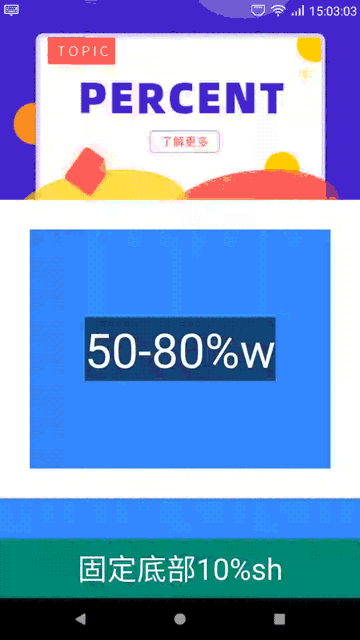
</div>

```xml
<?xml version="1.0" encoding="utf-8"?>
<com.tencent.vigatom.ue.layout.PercentRelativeLayout 
    xmlns:android="http://schemas.android.com/apk/res/android"
    android:layout_width="match_parent"
    android:layout_height="match_parent"
    xmlns:app="http://schemas.android.com/apk/res-auto"
    android:orientation="vertical">

    <ScrollView
        android:layout_above="@+id/v_bottom"
        android:layout_width="match_parent"
        android:layout_height="match_parent">

        <com.tencent.vigatom.ue.layout.PercentLinearLayout
            android:orientation="vertical"
            android:layout_width="match_parent"
            android:layout_height="wrap_content">

            <!--子控件，可以任意超过屏幕尺寸-->

        </com.tencent.vigatom.ue.layout.PercentLinearLayout>

    </ScrollView>

</com.tencent.vigatom.ue.layout.PercentRelativeLayout>
```

+ 4、横竖屏预览适配
> 提供了layout_isPreviewVertical属性可以设置预览的横竖屏方向，如果是竖屏，显示分辨率为1080X1920，横屏为1920X1080，便于开发编程

```xml
<?xml version="1.0" encoding="utf-8"?>
<com.tencent.vigatom.ue.layout.PercentRelativeLayout 
    xmlns:android="http://schemas.android.com/apk/res/android"
    android:layout_width="match_parent"
    android:layout_height="match_parent"
    xmlns:app="http://schemas.android.com/apk/res-auto"
    app:layout_isPreviewVertical="true">

    <!--子控件，基于竖屏尺寸1080*1920显示-->

</com.tencent.vigatom.ue.layout.PercentRelativeLayout>

```

## LICENSE
````
Copyright 2021 haide.yin(123302687@qq.com)

Licensed under the Apache License, Version 2.0 (the "License");
you may not use this file except in compliance with the License.
You may obtain a copy of the License at

    http://www.apache.org/licenses/LICENSE-2.0

Unless required by applicable law or agreed to in writing, software
distributed under the License is distributed on an "AS IS" BASIS,
WITHOUT WARRANTIES OR CONDITIONS OF ANY KIND, either express or implied.
See the License for the specific language governing permissions and
limitations under the License.
````